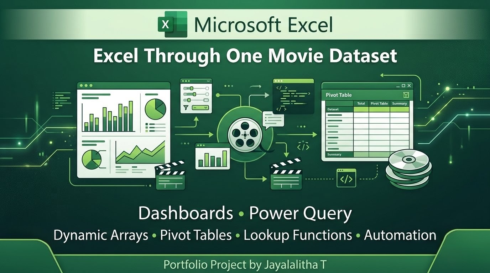

  

#  Excel Through a single Movie Dataset

> **Solving 15 Business Problems Using Microsoft Excel**

## About This Project

This repository documents my **15-Day Excel Portfolio Project**, completed as part of the **Codebasics Community Challenge**.

Instead of learning Excel functions individually, I used **one movie dataset** to solve **15 real-world business problems**, just like those faced by Business Analysts and MIS professionals.

Throughout this journey, I explored Excel features ranging from lookup functions and Pivot Tables to Power Query, Dynamic Arrays, dashboards, and decision-making tools.

Each day includes:

-  Business Scenario
-  Excel Demonstration
-  Screenshot
-  LinkedIn Video
-  Key Learning

---

##  Project Highlights

| Feature | Details |
|----------|---------|
|  Duration | 15 Days |
|  Dataset | One Movie Dataset |
|  Concepts Covered | 15 |
|  Business Problems | 15 |
|  Dashboards | Multiple |
|  LinkedIn Videos | 15 |
|  Final Workbook | Included |

---

## Skills Covered

- ✅ XLOOKUP & VLOOKUP
- ✅ Relative, Absolute & Mixed References
- ✅ IF & IFS Functions
- ✅ Text Functions
- ✅ Date Functions
- ✅ Pivot Tables
- ✅ Conditional Formatting
- ✅ SUMIFS
- ✅ INDEX + MATCH
- ✅ Power Query
- ✅ Dynamic Arrays
- ✅ Goal Seek & Scenario Manager
- ✅ Dependent Dropdowns
- ✅ Troubleshooting VLOOKUP
- ✅ Knowing When to Use Power BI

---

# Project Statistics

| Metric | Value |
|---------|------:|
|  Challenge Duration | 15 Days |
|  Dataset Used | 1 Movie Dataset |
|  Excel Concepts | 15 |
|  Business Scenarios | 15 |
|  Dashboards Created | Multiple |
|  LinkedIn Videos | 15 |
|  Final Excel Workbook | 1 |
|  Repository Type | Portfolio Project |

---

#  What You'll Find in This Repository

✔️ Day-wise Excel learning journey

✔️ Business scenarios with practical solutions

✔️ Excel workbooks and dashboard screenshots

✔️ Final Excel project

✔️ LinkedIn posts and video demonstrations

✔️ Step-by-step documentation

✔️ Business Analyst focused learning

---

#  Who Is This Repository For?

This repository is useful for:

-  Excel Beginners
-  Business Analyst Aspirants
-  MIS Executive Aspirants
-  Students learning Microsoft Excel
-  Anyone looking for practical Excel projects

---

#  15-Day Learning Roadmap

| Day | Topic | Open |
|-----|-------|------|
| 01 | XLOOKUP vs VLOOKUP | [📂 View](Day%2001%20-%20XLOOKUP%20vs%20VLOOKUP/) |
| 02 | Relative, Absolute & Mixed References | [📂 View](Day%2002%20-%20Relative%20Absolute%20References/) |
| 03 | IF & IFS | [📂 View](Day%2003%20-%20IF%20%26%20IFS/) |
| 04 | Text Functions | [📂 View](Day%2004%20-%20Text%20Functions/) |
| 05 | Date Functions | [📂 View](Day%2005%20-%20Date%20Functions/) |
| 06 | Pivot Tables | [📂 View](Day%2006%20-%20Pivot%20Tables/) |
| 07 | Conditional Formatting Dashboard | [📂 View](Day%2007%20-%20Conditional%20Formatting%20Dashboard/) |
| 08 | SUMIFS | [📂 View](Day%2008%20-%20SUMIFS/) |
| 09 | INDEX MATCH | [📂 View](Day%2009%20-%20INDEX%20MATCH/) |
| 10 | Power Query | [📂 View](Day%2010%20-%20Power%20Query/) |
| 11 | Dynamic Arrays | [📂 View](Day%2011%20-%20Dynamic%20Arrays/) |
| 12 | Goal Seek & Scenario Manager | [📂 View](Day%2012%20-%20Goal%20Seek%20%26%20Scenario%20Manager/) |
| 13 | Dependent Dropdowns | [📂 View](Day%2013%20-%20Dependent%20Dropdowns/) |
| 14 | Debugging VLOOKUP | [📂 View](Day%2014%20-%20Debugging%20VLOOKUP/) |
| 15 | When Excel Isn't Enough | [📂 View](Day%2015%20-%20When%20Excel%20Isn't%20Enough/) |
